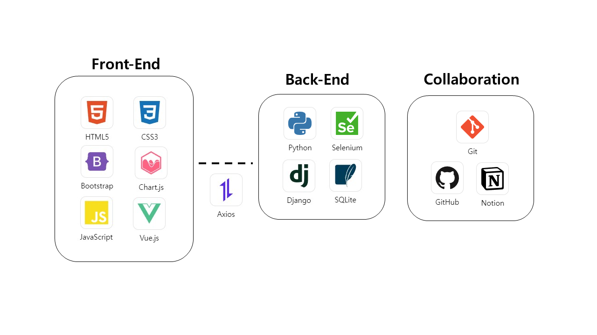
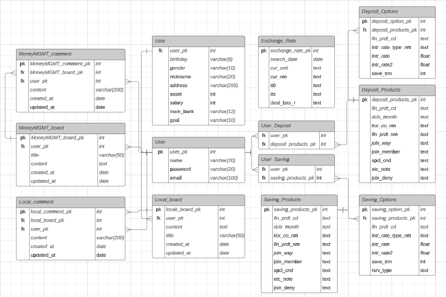
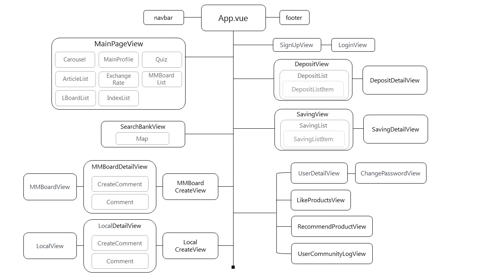
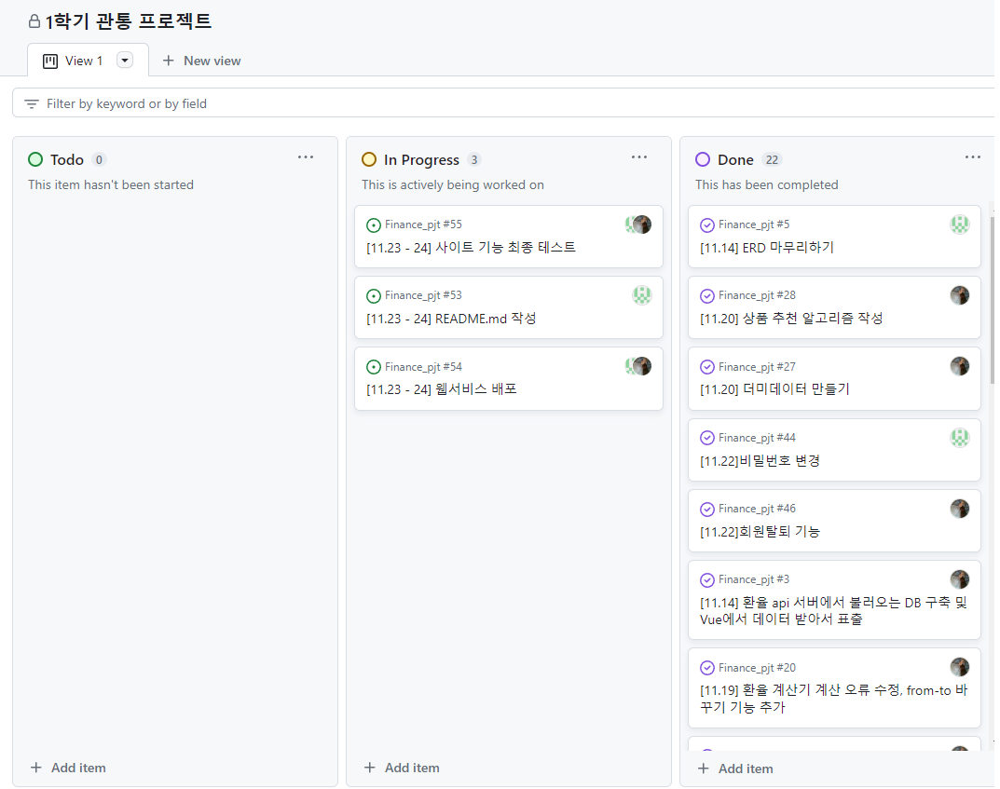

### 로고

###  📃컨셉 및 서비스 구상
- Findy 는 예적금부터 시작하는 사회초년생을 대상으로 간편하고 즐겁게 금융에 관련된 지식을 채우며 시드머니를 모으길 바라는 마음으로 본 사이트를 제작하였습니다.
- #00B992 민트 리프 색상
- 이 색상을 선택한 이유는 금융하면 신뢰가 중요하고 현재 싸피생들의 미래가 더 밝았으면 하는 생각으로 이 색을 저희 사이트의 컨셉 컬러로 지정하였습니다.

### 🎯GOAL

-   금융상품 데이터 기반 예금 및 적금 금리 비교 서비스 구성
-   금융 상품 추천 알고리즘 구성
-   환율 정보 API를 활용한 환율 계산 서비스 구성
-   지도 API를 활용한 은행 검색 서비스 구성
-   커뮤니티 서비스 구성 (지역 커뮤니티와 재테크 관련 커뮤니티)

### ⏰ 개발기간

-   일시 : 2023.11.14(화) ~ 2023.11.24(금)

### **🤝 팀원**
- 팀장 : 이시은
- 팀원 : 박영진

### 📢개발 계획
|  | 프론트엔드 | 백엔드 | 담당자 | |
| --- | --- | --- | --- | -
| 메인 페이지 | - 화면 디자인 뉴스 기사, 경제 퀴즈, 게시판 글 목록, 경제 지수, 광고 데이터를 받아서 화면에 표출 | - 뉴스 기사 및 각종 경제 지수 크롤링해서 프론트로 넘겨줌 | ALL |
| 회원 커스터마이징 | - 로그인하면 회원가입과 로그인 버튼 사라지고 로그아웃 버튼 생성 | 회원가입 후 사용자 정보 저장     - 로그인 후 상세페이지에서 각종 유저 정보 저장| 박영진 |
| 예적금 금리 비교 | - 예적금 데이터를 한눈에 알아보기 쉽게 표로 정리 데이터를 필터를 활용하여 필요한 은행이나 정보를 토대로 검색  | - 예적금 API로 받아온 정보를 DB에 저장 | 박영진 |
| 환율 계산기 | - back에서 환율 정보 받고, input으로 원하는 화폐 받아서 계산 후 표출 | - 한국수출입은행 api로 당일 환율 정보(없을 경우, 데이터가 있는 날까지 날짜가 뒤로 감)가져와서 DB에 저장 하루에 한번만 api 요청) | 이시은 | 
| 근처 은행 검색 | - 카카오맵 javascript api로 지도 표출 시, 구 선택 시, 해당 위치(시청 또는 구/군청)의 위경도 데이터 받아서 지도 중심 이동 은행 선택 시, 해당 은행 검색해서 지도에 마크 표시 현위치 버튼 누르면, 브라우저의 navigator에 담긴 정보를 사용해서 현위지로 지도 중심 이동 | X | 이시은 |
| 커뮤니티(게시판) | - 게시판 CRUD, 댓글 CRD게시판 화면 디자인 작성자, 제목으로 게시글 검색(필터링) | - 게시판 CRUD, 댓글 CRD (댓글은 수정 불가) 지역 기반 커뮤니티는 작성자의 지역을 반환 재테크 지식 커뮤니티는 작성자의 닉네임을 반환 | 이시은 |
| 프로필 페이지  | - 유저 정보 상세를 불러오기 유저가 작성한 게시글, 관심상품을 모아서 볼 수 있게 정리 | - 유저 상세정보 CRUD  | 박영진 |
| 프로필 페이지 - 금융 상품 추천 알고리즘 | - 백에서 받은 정보를 화면에 표출 | - 요청을 보낸 유저의 생년월일 기준 아래위 3년 범위, 주거래 은행, 목표 일치 유저 필터링 연봉, 자산 범위별 다른 갭을 줘서 해당 범위 안의 유저 필터링 필터링된 유저가 관심을 표시한 상품들 중 5개 랜덤 선택 - 상품수가 예금, 적금 둘 중 하나라도 5개 이하이면, 연봉, 자산은 필터에서 제외 추천 알고리즘에 사용된 유저의 평균 연봉, 자산 계산 | ALL |

### 🛠Tech Stack

### 💠데이터베이스 모델링(ERD)

### 📚컴포넌트 구조

### 🤝협업 방식

### 🧾개발일지

|  | 이시은 | 박영진 |
| --- | --- | --- |
| 2023-11-14 | 프로젝트 구상 및 ERD 제작, 환율 api 서버에서 불러오는 DB 구축 | 프로젝트 구상 및 ERD, 컴포넌트 제작 |
| 2023-11-15 | 주변 은행 검색 기능 추가, ERD 수정, 로고 및 컨셉컬러 수정 | 회원커스터마이징(회원가입, 로그인) 기능 추가 |
| 2023-11-16 | 커뮤니티 기능 작업 | 예적금 API DB 저장 |
| 2023-11-17 | 게시판 기능 완성 | 예적금 API 조회 |
| 2023-11-18 | 메인페이지 화면 구상 | 회원 상세정보 모델링 |
| 2023-11-19 | 뉴스기사 및 경제 지수 크롤링 | 회원 상세정보 조회 및 수정 기능 추가 |
| 2023-11-20 | 경제 퀴즈 메인페이지 표출, 더미데이터 생성, 상품 추천 알고리즘 작성 | 예적금 은행명 및 기간 별로 필터 기능, 예적금 관심상품 등록 기능 추가 |
| 2023-11-21 | 상품 추천 알고리즘 수정, 메인페이지 CSS 작업 | 예적금 페이지 CSS 작업 |
| 2023-11-22 | CSS 추가 작업, 회원가입 시 아이디 중복 체크 기능, 회원 탈퇴 기능, 관리자 체크 기능 | CSS 추가 작업, 비밀번호 변경 기능 |
| 2023-11-23 | CSS 추가 작업, 차트라이브러리 작업, 발표자료 준비 | CSS 추가 작업, 이자 계산기 작업, 발표자료 준비 |
| 2023-11-24 | 최종 점검 및 발표 준비 | 최종 점검 및 발표 자료 준비 |

### 🔥이슈 관리

| 이름 | 내용 | 해결여부(Y/N) | 해결과정 |
| --- | --- | --- | --- |
| 이시은 | 환율 api, CORS 에러 Vue에서 환율 api를 요청하려했는데, CORS policy에 의한 에러를 만났다. 이 에러는 브라우저에서 생성하는 에러로, url 출처가 같지 않을 때 발생한다. | Y | 서버 측에서 CORS를 허용하도록 풀어줘야 한다. 하지만 오픈 api는 서버를 건드릴 수 있으므로, 서버를 담당하는 django에서 api 요청을 보내고 자료를 db에 저장해서 프론트로 보내주는 방식으로 작성해야 한다. | 
|  | 메인페이지 화면이 데스크탑 100%가 아닐 경우 구성이 깨짐 | Y |  미디어 쿼리와 부트스트랩의 반응형 칼럼 사이즈 조절로 해결 |
|  | (!) Some chunks are larger than 500 kBs after minification. Consider: 배포과정중에 이러한 에러 발생 | Y | 용량 문제 때문이여서 chunkSizeWarningLimit 리밋을 늘림|
|  |배포 시 서버와 프론트 통신 장애 | N | AWS를 이용한 서버 배포 완료 -> 서버 ip로 접속 시 서버 접근 가능  - Netlify 프론트 배포 실패 - 크롬 브라우저에서는 http:// 를 허용하지 않음. - https:// 사이트에서는 http:// 요청을 허용하지 않음 (보안 상 위험) - AWS 서버는 https:// 를 가질 수 없음 -> https:// 하려면 인증서가 있어야하고, 인증서를 받으려면 도메인이 있어야 하고, 도메인을 받으려면 route53 에서 도메인을 구매해야 함 => https:// 프론트에서는 http:// 서버에 요청을 보낼 수 없기 때문에 최종적으로 돈 안 내고 배포하기는 할 수가 없다. ⇒ 프론트에서 요청을 프록시로 우회하는 것을 시도해보았으나 완전한 해결이 되지 않음 ([https://velog.io/@jiheon788/Netlify에서-HTTPS-HTTP-통신-해결-과정](https://velog.io/@jiheon788/Netlify%EC%97%90%EC%84%9C-HTTPS-HTTP-%ED%86%B5%EC%8B%A0-%ED%95%B4%EA%B2%B0-%EA%B3%BC%EC%A0%95) 참고 사이트) - 배포 시, 지도 api 요청이 정상적으로 가지 않음을 발견했으나 해결하지 못함 - 배포한 서버를 사용 시, 서버 측에 크롬드라이버가 깔리지 않아 코스피를 가져오는 동적 크롤링이 수행되지 못함 → 크롬 설치만 하면 될 듯 |
| 박영진 | POST http://127.0.0.1:8000/accounts/signup/ 400 (Bad Request) | N | 계속 배드요청이 떠서 해결하지 못함 다 지우고 처음부터 작성해서 해결 됐음 |
|  | http://views.py 에서 @API_VIEW 요청을 빼먹고 안 적어줬음 | Y | @API_VIEW 요청 작성후 해결 |
|  | router로 params 값을 2개 이상 넘겨줄때 url에서 하나만 넘겨주는 방법 밖에 몰라서 params를 제대로 넘기지 못해서 오류 | Y | url에 ~~/:id/:pk 이렇게 이어서 적어 주니 해결 |

### 🪢서비스 구현

| NO | 구분 | 기능 | 구현정도(⭐⭐⭐⭐⭐ ) |
| --- | --- | --- | --- |
| 1 | 메인페이지 | 메인페이지 레이아웃 및 디자인 CSS | ⭐⭐⭐⭐⭐     |
| 2 |  | 최신 경제 뉴스, 환율, 금, 유가, 코스피 볼 수 있도록 데이터 크롤링 | ⭐⭐⭐⭐⭐     |
| 3 |  | 경제 퀴즈 | ⭐⭐⭐⭐ (카드 뒤집기 기능 구현 실패)  |
| 4 |  | 웹 서비스 소개 Carousel 기능 구현 | ⭐⭐⭐⭐⭐     |
| 5 |  | 최신 게시글 5개 표시 및 게시판으로 이동하기 | ⭐⭐⭐⭐⭐     |
| 6 | 회원 커스터마이징 | 회원 가입 및 로그인/ 로그아웃 기능 및 화면 구현 | ⭐⭐⭐⭐⭐     |
| 7 |  | 회원/ 비회원에 따라 화면 다르게 나타나도록 구현 | ⭐⭐⭐⭐ (모든 화면에 가드를 적용하지 않음)     |
| 8 |  | 회원가입시 아이디 중복확인 | ⭐⭐⭐⭐⭐     |
| 9 | 예/적금 금리 비교 | API 활용해 금융 상품 DB 저장 | ⭐⭐⭐⭐⭐     |
| 10 |  | 관심상품 등록 기능 및 조회 | ⭐⭐⭐⭐⭐     |
| 11 |  | 상품 상세 정보 화면 구현 | ⭐⭐⭐⭐ (CSS가 부족함)     |
| 12 |  | 카테고리별 검색 기능 | ⭐⭐⭐⭐⭐     |
| 13 |  | 이자계산기 기능 구현 | ⭐⭐⭐⭐⭐     |
| 14 | 환율계산기 | API를 활용한 환율 정보 DB 저장  | ⭐⭐⭐⭐⭐     |
| 15 |  | axios 활용하여 환율 정보 가공 및 화면 구현 | ⭐⭐⭐⭐⭐     |
| 16 |  | 화폐 선택 시 국기 이미지 표시 | ⭐⭐⭐⭐⭐     |
| 17 | 은행 검색 지도 | API를 활용하여 Kakao 맵 화면 구현   | ⭐⭐⭐ (특별한 기능이 없음 + 프론트 배포 시 동작 안함)    |
| 18 |  | 키워드에 맞는 검색 결과 구현 | ⭐⭐⭐⭐⭐     |
| 19 |  | 카카오 맵 마커에 장소 정보 표시  | ⭐⭐⭐⭐ (디테일한 정보 부족)    |
| 20 | 커뮤니티 | 게시글 및 댓글 CRUD 기능 구현 | ⭐⭐⭐⭐⭐     |
| 21 |  | 게시글 검색 기능 구현  | ⭐⭐⭐⭐⭐     |
| 22 |  | 게시글을 카테고리에 따라 작성자 표시를 다르게 구현 | ⭐⭐⭐⭐⭐     |
| 23 | 유저 프로필 | 회원 정보 수정, 비밀번호 변경 기능 | ⭐⭐⭐⭐⭐     |
| 24 |  | 회원 탈퇴 기능 | ⭐⭐⭐⭐⭐     |
| 25 |  | 본인이 작성한 게시글 조회 | ⭐⭐⭐⭐⭐     |
| 26 |  | 관심상품 등록한 예/적금 상품 조회 | ⭐⭐⭐⭐⭐     |
| 27 |  | 유저정보에서 입력 받은 정보를 기반으로 상품 추천 알고리즘 | ⭐⭐⭐⭐⭐     |
| 28 |  | 차트 라이브러리 통해 금리 비교  | ⭐⭐⭐⭐ (커스터마이징이 부족함)    |
                                  

### 🍀 배운점 및 느낀점

-   이시은

프로젝트를 진행하며, 드디어 백엔드와 프론트엔드에서 해야하는 일과 둘 사이 통신과정이 정리된 것 같다.
필수 요구 사항들을 정리할 때, 다 배운 것들이라 빠르게 끝낼 수 있을 줄 알았는데
단순히 지식을 머리에 넣는 것과 실제로 구현하는 것은 굉장히 큰 차이가 난다는 것을 알게 되었다.

내가 걱정이 많고 오점을 남기지 않으려하는 성향을 가져서 내 페어가 쉽지 않았을 것 같다.
처음에는 기본만 하자고 생각했다가 기능들이 완성되는 것을 보니 점점 욕심이 생겨서 디테일에 짐착하게 되었다.
디테일에 집착하는 나에게 화내지 않고 하자는대로 해줘서 고맙고, 사이트에서 가장 중요한 회원 기능을 잘 구축해줘서 고맙다.
프로젝트가 처음이었는데, 이래서 기업에서 프로젝트 경험을 중요하게 보는구나를 알 수 있었다. 문제 해결의 집합체인 것 같다. 무엇하나 쉽게 되는게 없었지만 그래서 더 많이 배우는 과정이었다. 뿌듯하다 핀디^-^

-   박영진
  
약 5개월 동안의 학습을 토대로 10일 간의 프로젝트를 성공적으로 마무리하게 되어 정말 의미있었습니다. 프로젝트를 시작하기 전에는 스스로의 능력에 대한 의심과 불안이 많았지만, 페어의 도움으로 극복하고 진행할 수 있었습니다.

프로젝트를 통해 느낀 점 중 하나는 수업에서 배우는 것과 직접 프로젝트를 구상하고 구현해 나가는 것은 전혀 다르다는 것입니다. 자체적으로 아이디어를 발전시키고 구현해 나가는 과정에서 더 많은 학습과 성장이 이루어진 것 같습니다. 이는 수업에서 얻은 지식을 실전에서 적용하고 확장해 나가는 경험이라고 생각합니다.

또 ,열심히 프로젝트를 진행한 페어 시은에게 감사의 인사를 전하고 싶습니다. 그녀의 도움 덕분에 프로젝트를 성공적으로 완료할 수 있었고, 함께 노력하고 배우며 성장한 시간이 정말 뜻깊었습니다.
마지막으로 ,처음 프로젝트를 기획할때 워라밸은 꼭 지키자고 서로 얘기를 해서 처음엔 과연 이 약속이 쭉 지속이 가능할까 했지만 마지막까지 이 약속을 지키게 해준 페어 시은이에게 다시 한번 고맙다는 말 전하고싶습니다 !
